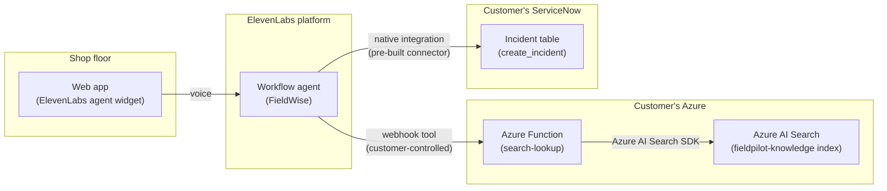

# Submission notes (for the Ashby written aside)

## Architecture
Two different integration patterns, deliberately — a customer-controlled webhook for
knowledge lookup, a pre-built native connector for escalation. Both reach into systems
the customer already runs; neither duplicates their data into ElevenLabs.

## Why a webhook tool, not ElevenLabs' native knowledge base
Native KB upload means duplicating a customer's documentation into a third-party
vendor's storage — stale the moment source docs change, and a governance question most
enterprise customers won't wave through. A webhook back into the customer's own system
keeps their documentation as the source of truth and their existing auth/governance in
place. More integration work up front, but it's the shape that survives a real
enterprise security review.

## Why a Function in between, not calling Azure AI Search directly
A direct search response carries `@odata.score`, internal IDs, empty fields — exactly
what shouldn't be spoken out loud. The Function shapes that into clean
`{found, answer, needs_clarification, candidates}` JSON instead. It also owns the
disambiguation logic (best-match search, then a filtered query for every row sharing
that match's `group_id`) — a webhook tool is one templated call, it can't branch. And it
keeps the same customer-controlled mediation as the KB argument above: their backend
talks to their search index, not a raw key baked into ElevenLabs' tool config.

No second lookup is needed for the follow-up disambiguation question either — the first
search call already returns every candidate cause with its distinguishing condition, so
the agent narrows down from data it already has rather than querying again.

## Moving from a flat prompt to an ElevenLabs workflow
Everything past the initial dashboard pass was rebuilt through the Python SDK instead of
further manual editing — see `agent/duplicate_agent.py` and `agent/build_workflow.py`.
The original agent stays untouched as a fallback; the rebuild is a duplicate.

The rebuild replaces branching logic embedded in one long system prompt with an actual
[ElevenLabs workflow](https://elevenlabs.io/docs/eleven-agents/customization/agent-workflows):
8 nodes (greet → knowledge lookup → answer-or-clarify → escalate → confirm → end), each
carrying only the instructions relevant to that step. Result: the agent-level prompt
shrank from **~1,470 characters** of mixed persona-and-branching-logic down to
**~330 characters** of persona/tone only. Getting the workflow JSON right meant
introspecting the SDK's actual Pydantic models (`elevenlabs.types`) rather than
guessing from docs — that's also how a couple of real platform quirks got found along
the way (a "no duplicate edge between the same node pair" API constraint, requiring a
bidirectional lookup↔clarify relationship to be modeled as one edge with a forward and a
backward condition, not two).

## Two things found during testing, verified against real conversation data via the SDK
**A misdiagnosis, corrected.** `servicenow_create_incident`'s `instance`/`domain` path
params looked unpopulated in the tool's static definition, which first read as a
platform bug. It wasn't — pulling actual conversations via
`client.conversational_ai.conversations.get` showed the tool succeeding every time, with
real incident numbers and the params correctly resolved from the connection at call
time. The static definition alone wasn't enough to trust; watching it execute was.

**A real workflow bug, fixed.** Two `generate_immediately` nodes sometimes fired their
next workflow-transition tool *before* speaking — confirmed by reading conversation
turns' `workflow_node_id`/`tool_calls`/`message` fields directly. A prompt-only fix
("speak first") helped but wasn't reliable. The structural fix: change the affected
edges from `unconditional` to `llm`-conditioned on "the agent has already spoken this
out loud" — giving the model something to actually evaluate instead of a free
transition. That fixed the escalation-confirmation step, retested live. A related case
(a lookup tool re-firing before speaking) only had a prompt-strengthening fix available,
since the platform blocks a second edge between the same node pair — retested clean
twice since, but it's a mitigation, not a structural guarantee the other fix is.

## Next steps, not built here
Fronting Azure AI Search through MCP (e.g. Azure API Management's REST-as-MCP-server
capability) would centralize governance over what the agent can query — the natural
next step for a production rollout, out of scope for a 5-day build.
