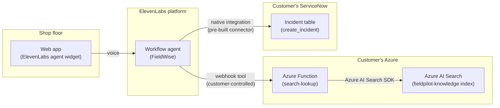

# Submission notes (for the Ashby written aside)

## Architecture
Two different integration patterns, deliberately — a customer-controlled webhook for
knowledge lookup, a pre-built native connector for escalation. Both reach into systems
the customer already runs; neither duplicates their data into ElevenLabs.

The two right-hand branches are the two things this doc argues about below: why the
knowledge path is a webhook into a backend we control (and why a Function sits between
the agent and Azure AI Search rather than calling it directly), and what actually
happened when escalation instead went through ElevenLabs' pre-built connector.

## Why a webhook tool, not ElevenLabs' native knowledge base
The native KB upload means duplicating a customer's documentation into a third-party vendor's
storage — that's stale the moment the source docs change, and it's a governance/security
question most enterprise customers won't wave through (whose access controls apply? whose
retention policy? who audits it?). A webhook tool that calls back into the customer's existing
system — here, Azure AI Search — keeps their documentation as the single source of truth and
their existing auth/governance in place. It's more integration work up front, but it's the
shape that actually survives a real enterprise security review, which is the point of the
exercise: show how an SE would really wire ElevenLabs into a customer's stack, not just what
demos fastest.

## Why an Azure Function in between, not ElevenLabs calling Azure AI Search directly
Azure AI Search does have a plain REST endpoint, so a shorter path would point the webhook
tool straight at it. Didn't do that, for reasons that compound the point above:
- **Raw Azure output isn't safe to speak.** A direct search response carries `@odata.context`,
  `@search.score`, internal IDs, empty-string fields — exactly what the agent's system prompt
  says never to read out loud. The Function's job is shaping that into clean
  `{found, answer, needs_clarification, candidates}` JSON.
- **The disambiguation flow needs two sequential Azure calls** (best-match search, then a
  filtered query for every row sharing that match's `group_id`) — a webhook tool is one
  templated HTTP call, it can't branch or chain a second request. That orchestration needs
  actual code somewhere.
- **It keeps the same customer-controlled mediation layer** as the KB argument above, one
  layer down: the customer's backend — not a raw key baked into ElevenLabs' tool config — is
  what talks to their live search index, so they keep logging, redaction, rate-limiting, and
  key rotation on their side, and can swap in the API Management/MCP gateway below later
  without ElevenLabs' config changing at all.
- It's also the explicit ask in the brief: "Azure AI Search Python/JS SDK internally, not raw
  REST calls."

## Why not MCP yet
Fronting Azure AI Search through MCP (e.g. via Azure API Management's "expose REST API as MCP
server" capability) is the more enterprise-grade version of this same pattern — centralized
governance and auth over exactly what the agent can query, reusable across other agents/tools
beyond just this one. It's the natural next step for a production rollout. For a 5-day build
it adds real setup complexity without changing what the demo proves, so this build uses a
direct webhook tool and calls out the MCP path as the acknowledged next step rather than
building it.

## Why no cache/session store for the disambiguation step
The brief raised the question of whether a second Azure AI Search call (or a cache to avoid
one) is needed when the agent asks a clarifying follow-up — e.g. narrowing down alarm 402's
three possible causes. The build avoids both: the *first* search call already returns every
candidate cause along with the condition that distinguishes it (cutting under load vs.
power-on vs. intermittent/coolant-related). The agent's system prompt has it ask one narrowing
question and then resolve from that same tool response, rather than calling the tool again.
No stateful cache/session infra needed for this demo.

If you wanted the same "don't re-query" behavior to hold across tool calls in general (say, a
much larger index where you can't afford to return every candidate up front), the natural
extension is a short-TTL cache keyed by the conversation ID — e.g. Azure Table Storage or
Redis — populated on the first lookup and read on any lookup within the same conversation
before hitting Azure AI Search again. Not needed here, but it's the right lever to pull if the
knowledge base grows past what's reasonable to return in one response.

## Agent-as-code, and moving from a flat prompt to a workflow
Everything past the initial dashboard configuration pass was rebuilt through the ElevenLabs
Python SDK instead of further manual dashboard editing — see `agent/duplicate_agent.py` and
`agent/build_workflow.py`. Two reasons: it's reviewable/diffable the same way the rest of this
repo is, and it let me introspect the SDK's actual Pydantic models (`elevenlabs.types`) to get
the workflow JSON schema right against the real API instead of guessing from docs.

The original agent (`agent_9001m1ye0esbfxd8qcrrr8tvzy0g`) is left completely untouched —
`duplicate_agent.py` clones its full live config into a new agent
(`agent_1401m216hed0eec9p6k3vfsmbge7`, "Field Technician Assistant (Workflow)") before
`build_workflow.py` makes any changes, so the original stays available as a fallback/diff
baseline the whole time.

The rebuild replaces the flat, branching-logic-in-the-system-prompt design with an actual
[ElevenLabs workflow](https://elevenlabs.io/docs/eleven-agents/customization/agent-workflows):
8 nodes (start → greet/listen → knowledge lookup → answer-or-clarify → escalate →
confirmed/failed → end), with the lookup↔clarify relationship modeled as one bidirectional
edge (`forward_condition` for the tool succeeding, `backward_condition` for a follow-up
question looping back to another lookup) rather than two separate edges — the platform
rejects two edges between the same node pair. The payoff: the agent-level system prompt
shrank from ~1,470 characters of mixed persona-and-branching-logic down to ~330 characters of
persona/tone only, because each step's specific instructions (what to do with a multi-cause
result, how to confirm an escalation) now live on that step's own node instead of one agent
having to hold the entire conversation's logic in its head at once.

## Correction: the ServiceNow tool was never actually broken
An earlier pass through this build concluded `servicenow_create_incident` had a confirmed
platform-side bug — its `instance`/`domain` path params showed `is_system_provided: true`
with an empty `constant_value` and empty `dynamic_variable` in the tool's static definition
(via `client.conversational_ai.tools.get`), which read as "nothing populates these, ever."
A scoped fix was attempted from `build_workflow.py` (`WorkflowToolLocator.schema_overrides`,
supplying `dev292793`/`service-now.com` directly), and the API rejected it outright:
`"Cannot override system provided property 'instance'"` / `'domain'`. At the time, that
rejection read as confirmation of the bug.

It wasn't. Pulling two actual live conversations after the fact (via
`client.conversational_ai.conversations.get`, not just the dashboard transcript view) showed
`servicenow_create_incident` succeeding both times, with real incident numbers
(`INC0010002` among them) and the path params correctly populated at call time
(`instance: "dev292793"`, `domain: "service-now.com"`) — resolved from the tool's
`api_integration_connection_id` at execution time, not from the static `constant_value`/
`dynamic_variable` fields that looked empty. Those two fields simply aren't how a
system-provided value gets filled in; reading their emptiness as "nothing will populate
this" was the actual mistake. The API's rejection of the schema override was correct
behavior, not evidence of a gap — you shouldn't be able to override a value the platform
already supplies properly.

Leaving this in the writeup rather than deleting it: verifying a claimed bug against the
tool's *static* definition alone wasn't enough — the real test was watching it execute in an
actual conversation, which is what settled it in either direction.

## A real bug found along the way: workflow nodes skipping their spoken line
While testing the built workflow live, two `override_agent` nodes with
`entry_behavior: generate_immediately` — `answer_or_clarify` and `escalation_confirmed` —
sometimes fired their outgoing workflow-transition tool call as their *first* action instead
of speaking. Concretely: at `answer_or_clarify`, the model called the same lookup edge twice
in a row before ever producing text; at `escalation_confirmed`, it called the
transition-to-`end_node` tool immediately on entry and the call hung up without the agent
ever confirming the escalation out loud. Confirmed by pulling the conversation transcript via
the SDK and inspecting each turn's `workflow_node_id`/`tool_calls`/`message` fields directly,
rather than guessing from the dashboard view.

Root cause: each node's `additional_prompt` described *what* to say but never explicitly
said speaking had to happen *before* any tool or transition call — and a model with an
available "obviously correct" next action (an edge with nothing to weigh, or the same lookup
tool it just used) will sometimes just take it. First fix attempt: every
`generate_immediately` `override_agent` node's prompt got an explicit "SPEAK FIRST, before
calling any tool or ending the call" instruction. That helped but wasn't sufficient —
retested live afterward and `escalation_confirmed` still skipped its spoken line entirely on
a second run, while the same prompt wording *did* work earlier in the same conversation at
`answer_or_clarify`. A pure prompt instruction competing against an available tool call is
inconsistent, not reliable.

Second, structural fix: `escalation_confirmed`/`escalation_failed` → `end_node` were
`unconditional` edges, meaning the model has literally nothing to weigh before firing them —
they're "always ready." Changed both to `llm`-conditioned edges instead, with the condition
tied directly to the thing that needs to be guaranteed: *"The agent has already spoken the
escalation confirmation out loud in this turn."* That forces the model to evaluate whether
it's actually true before it can honestly advance, rather than having a free, unweighted
transition available on entry. Retested live afterward — worked: `escalation_confirmed` spoke
its line correctly ("I've logged an incident so maintenance can take over — shut Machine 12
down now and follow lockout/tagout while you wait.") before the call ended.

That same retest surfaced the same failure pattern in a different spot, though:
`search_knowledge_base` fired twice in a row again for a single question, via
`answer_or_clarify`'s own backward edge back to `lookup_knowledge`. Couldn't apply the same
structural fix here — the platform rejects two edges between the same node pair (see the
duplicate-edge API error earlier in this doc), so the forward (tool succeeded) and backward
(technician asks a new question) transitions are forced to share one edge/tool, and nothing
stops the model from re-firing that shared tool immediately after getting its result back,
before speaking. Applied a more targeted version of the prompt fix instead: the backward
edge's condition text now explicitly says it's false if there's already an unspoken result
in hand, and the node's prompt names the exact failure mode directly ("Do NOT look it up
again, even if it feels like the technician's question is still open — it isn't"). This is
prompt-strengthening, not a structural guarantee like the escalation fix — worth another live
retest to see whether it actually holds, not just assuming it does because the wording is
more emphatic.
